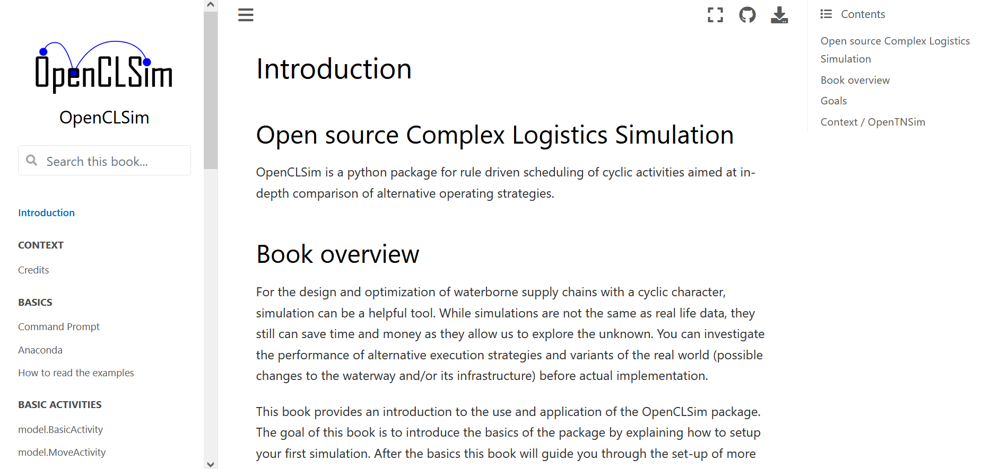

[](https://openclsim.readthedocs.io)
[](https://github.com/TUDelft-CITG/OpenCLSim/blob/master/LICENSE.txt)
[](https://doi.org/10.5281/zenodo.3730615)

[](https://dl.circleci.com/status-badge/redirect/gh/TUDelft-CITG/OpenCLSim/tree/master)

# OpenCLSim

**Open** source **C**omplex **L**ogistics **Sim**ulation - Rule driven scheduling of cyclic activities for in-depth comparison of alternative operating strategies. For background please read our [WODCON 2022 paper](https://www.dredging.org/resources/ceda-publications-online/conference-proceedings/abstract/1126), also available at [ResearchGate](https://www.researchgate.net/publication/360852095_OpenCLSim_Discrete_Event_Dredging_Fleet_Simulation_to_Optimise_Project_Costs). And our [Terra et Aqua 2023 paper](https://www.iadc-dredging.com/article/simulating-for-sustainability-alternative-operating-strategies-for-energy-efficiency/), available at [ResearchGate](https://www.researchgate.net/publication/371782674_Simulating_for_Sustainability_Alternative_Operating_Strategies_for_Energy_Efficiency) as well.

Documentation is found [here](https://openclsim.readthedocs.io).

## Book


<a href="https://delightful-cliff-0e49c3503.1.azurestaticapps.net/Intro_draft.html"></a>

You can find the OpenCLSim book, based on the examples in the `notebooks` folder on the [OpenCLSim-book](https://delightful-cliff-0e49c3503.1.azurestaticapps.net/Intro_draft.html) website.

The book is only build from the master branch and the special "feature/book" branch. For testing your book you can use the feature/book branch.

## Installation

To install OpenCLSim, run this command in your terminal. This is the preferred method to install OpenCLSim, as it will always install the most recent stable release. In general you want to install python software in a virtual environment, either using [anaconda](https://docs.anaconda.com/anaconda/install/) or through python's default [virtual environment](https://docs.python.org/3/tutorial/venv.html).

``` bash
pip install openclsim
```

For local development use:

``` bash
pip install -e .[testing]
```

If you do not have [pip](https://pip.pypa.io) installed, this [Python installation guide](http://docs.python-guide.org/en/latest/starting/installation/) can guide you through the process. You can read the [documentation](https://openclsim.readthedocs.io/en/latest/installation.html) for other installation methods.

## Examples

The benefit of OpenCLSim is the generic set-up. This set-up allows the creation of complex logistical flows. A number of examples are presented in a seperate [Jupyter Notebook repository](https://github.com/TUDelft-CITG/OpenCLSim-Notebooks). Information on how to use the notebooks is presented in that repository as well.

## Running in Docker while developing

	Best run in WSL to have parameterized mounts. Otherwise in cmd/PS.
	
	For developers issue yourselves
	pip install -e .

	# if you changed the python requirements or Dockerfile: rebuild image, avoid using the old cache
	docker build --no-cache . -t  openclsim # same name as in yml: image: 'openclsim'
	
	# do only this if you did not update requirements
    docker-compose -f docker-compose_dev.yml up -d     # 1st  time: (re)creates container 'openclsim' from image 'openclsim' as defined in yml
    docker-compose -f docker-compose_dev.yml  start     # each time: this will run the existing container 'openclsim' as defined in yml
    docker ps                # see running containers
    docker exec -it gee bash # run a prompt in container instance 'openclsim' of image 'openclsim'
	
	# this row get lot from history completion after rebuild
    jupyter notebook --ip 0.0.0.0 --allow-root --no-browser --port=8888
	jn                       # alias for above defined in Dockerfile
	
    docker-compose stop      # each time: this will keep your container 'openclsim' incl. modifications and bash history
    docker-compose down      # last time: destroys container 'openclsim' (not image 'openclsim')
